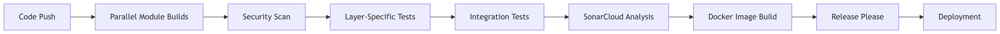
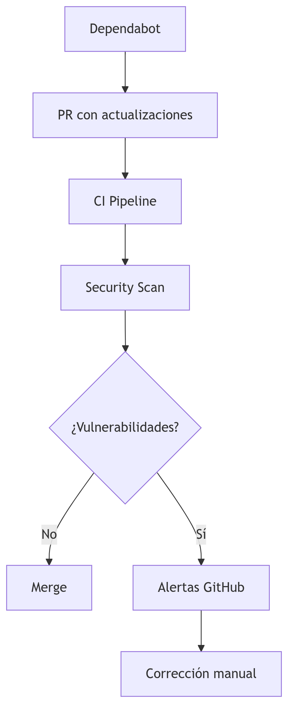

# 🚀 Reactive Microservice Template (Mono-Module)

## 📊 Project Health
[](https://github.com/marcoslozina/java-springboot-reactive-hexagonal-monomodule-template/actions/workflows/ci.yml)

[](https://sonarcloud.io/summary/new_code?id=marcoslozina_java-springboot-reactive-hexagonal-monomodule-template)


[](https://github.com/marcoslozina/java-springboot-reactive-hexagonal-monomodule-template/releases)

## 🌟 Overview

Production-grade reactive microservice template built with Spring Boot 3.2, based on Hexagonal Architecture, designed with Java 21 and WebFlux for cloud-native environments.

## ✨ Architecture Benefits

- 🧱 Strict modular boundaries
- ↔️ Clear dependency flow: `domain ← application ← adapters`
- 🧪 Independent testability per layer
- 🚀 Parallel builds per module
- 🔒 Isolated security configurations

## 🛠️ Tech Stack

### Core Framework

| Component      | Version | Module         |
|----------------|---------|----------------|
| Java           | 21      | All            |
| Spring Boot    | 3.5.3   | Infrastructure |
| Spring WebFlux | 3.5.3   | Adapters:In    |
| Gradle (KTS)   | 8.12    | Root           |

### Persistence

| Component  | Version | Module       |
|------------|---------|--------------|
| R2DBC      | 3.2.5   | Adapters:Out |
| Flyway     | 9.22.3  | Adapters:Out |

### Observability

| Component        | Version | Module         |
|------------------|---------|----------------|
| Micrometer       | 1.15.0  | Infrastructure |
| Logstash Logback | 8.1     | Shared         |
| SonarCloud       | Latest  | CI/CD          |

### Security

| Component        | Version | Use                          |
|------------------|---------|-------------------------------|
| Dependabot       | Latest  | Dependency updates             |
| GitHub Security  | Latest  | Vulnerability alerts           |
| OWASP DC         | 8.4.1   | CI/CD scanning                 |

## 🔄 CI/CD Pipeline



### 🔧 Pipeline Stages

- **Parallel Build**: Independent compilation per module
- **Security Scan**:
    - OWASP Dependency Check
    - CodeQL Analysis
    - Dependabot alerts
- **Testing**:
    - Unit tests (per layer)
    - Integration tests (Testcontainers)
    - Architecture tests (ArchUnit)
- **Quality Gate**:
    - SonarCloud analysis
    - Coverage enforcement (80% minimum)
- **Release**:
    - Automatic semantic versioning
    - CHANGELOG generation
    - Artifact publication

## 🔍 Quality and Security Tooling

### 🔒 Automated Security

- **Dependabot**: Daily updates for vulnerable dependencies
- **GitHub Security Alerts**: Continuous vulnerability (CVE) monitoring
- **OWASP Dependency Check**: CI scanning with HTML report
- **CodeQL**: Static analysis for code vulnerabilities

### 📊 Code Quality

- **SonarCloud**:
    - Continuous static analysis
    - Custom rules for hexagonal architecture
    - Quality gate with custom metrics
- **Release Please**:
    - Automated semantic releases
    - `CHANGELOG.md` generation
    - Conventional commits handling

## 🚀 Getting Started

### 🔧 Development Commands

```bash
# Run with live reload
./gradlew :infrastructure:bootRun --continuous

# Run local security scan
./gradlew dependencyCheckAnalyze

# Generate report for SonarCloud
./gradlew jacocoRootReport sonarqube

# Check for vulnerable dependencies
./gradlew dependencyUpdates -Drevision=release
```

## 🔍 Security Workflow



## 🛡️ Security Policies

- Automatic daily dependency scanning
- Merge blocking on critical vulnerabilities
- 2-approval requirement for major updates
- Slack notifications for security alerts

## ☕ Donations

If this project or the book was useful to you, you can support its development with a donation. Your support helps maintain and improve this kind of educational content.

[](https://buymeacoffee.com/codefuel)
[](https://www.paypal.com/donate/?hosted_button_id=4TYGJ5S8CLX8J)

- ☕ [Buy Me a Coffee](https://buymeacoffee.com/codefuel)
- 💳 [PayPal Donate](https://www.paypal.com/donate/?hosted_button_id=4TYGJ5S8CLX8J)

---

## 📜 License

This project is licensed under the MIT license. See `LICENSE` for details.

## 🔍 Security Policy

To report security vulnerabilities, please refer to our Security Policy and use GitHub Security Advisories. All vulnerabilities will be investigated within 24 hours.
